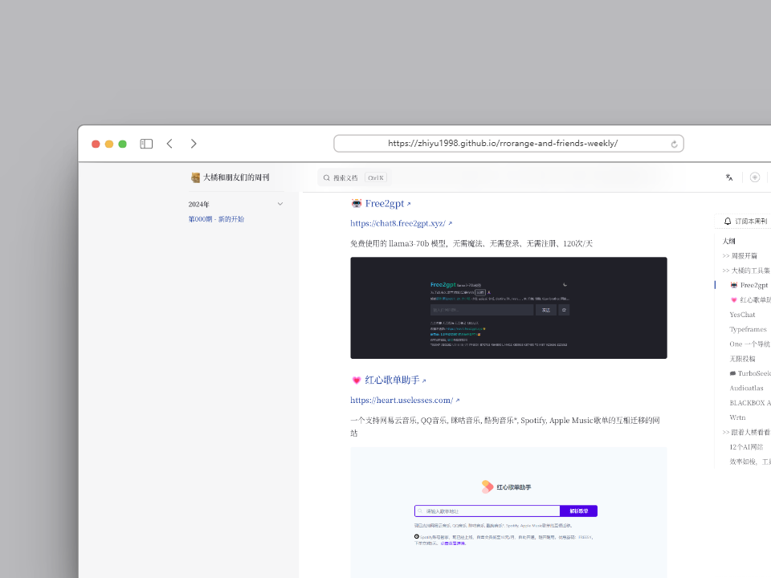

<div align="center">

<a href="https://github.com/zhiyu1998/rrorange-and-friends-weekly" target="blank">
  
</a>

# 《大橘和朋友们的周刊》


记录每周冲浪互联网看到好玩的网站、app应用、资源分享、效率软件工具集等

如果内容丰富最快的话`预计是每周六/周末发布`

如果思维枯竭就`视情况发布新内容`，欢迎 star 🌟



</div>


## 特性

- 🌓 提供明暗模式切换功能，适应不同的阅读环境。
- 🌍 支持中英双语界面，方便不同语言用户的使用。
- 📡 提供RSS订阅功能，支持中英文内容更新推送。
- 💬 集成Giscus评论系统，便于用户交流和反馈。
- 🖼️ 支持高清大图预览，优化视觉体验。
- 📜 允许自定义字体设置，提升阅读舒适度。
- 🔍 进行SEO优化，包括Sitemap生成、Twitter Card和Open Graph标签支持，提高搜索引擎可见性。


## 开发

```bash
yarn
yarn docs:dev
```
1. 修改giscus评论配置，`.vitepress/theme/components/Comments.vue`中的`giscus`配置项;
2. 修改`utils`文件夹下的中的侧边栏配置、RSS配置、元信息配置等;
3. 修改`config`文件夹下的相关配置，主要是title、description等;
4. 修改`posts/**`与`en/posts/**`目录中的文章内容为自己的内容;

## 致谢
感谢一下开源库提供的模板和工具本周刊的支持
- [FAV0](https://github.com/Justin3go/FAV0)

## 协议

本仓库采用双协议授权，即MIT协议和CC-BY-4.0协议：

- 所有`.md`文件采用CC-BY-4.0协议协议，你需要保留署名权
- 其他代码文件采用MIT协议，你可以自由使用

具体内容请查看[LICENSE](./LICENSE)文件。
